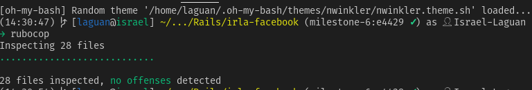
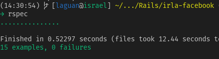
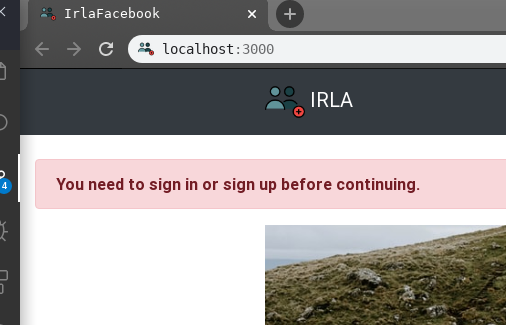
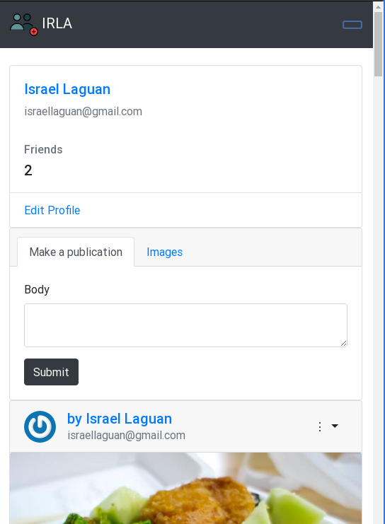
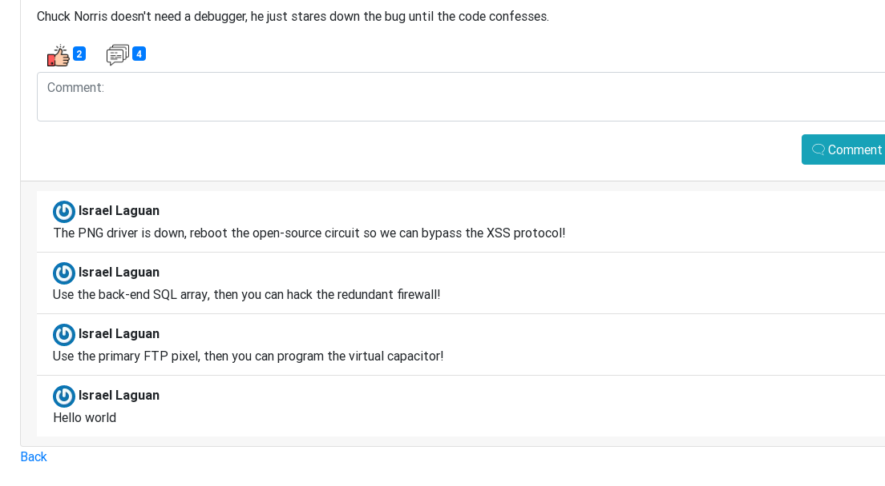

<!-- PROJECT SHIELDS -->
<!--
*** I'm using markdown "reference style" links for readability.
*** Reference links are enclosed in brackets [ ] instead of parentheses ( ).
*** See the bottom of this document for the declaration of the reference variables
*** for contributors-url, forks-url, etc. This is an optional, concise syntax you may use.
*** https://www.markdownguide.org/basic-syntax/#reference-style-links
-->
[![Contributors][contributors-shield]][contributors-url]
[![Forks][forks-shield]][forks-url]
[![Stargazers][stars-shield]][stars-url]
[![Issues][issues-shield]][issues-url]
[![MIT License][license-shield]][license-url]

<!-- PROJECT LOGO -->
 

  

  <h3 align="center">
	irla-Facebook
  </h3>

  

    An impememnation of a social media site like facebook with most backend compatibility
     
    <a href="https://github.com/raheebwa/irla-facebook/blob/master/README.md"><strong>Explore the docs 📚</strong></a>
     
     
	  🖊️
    <a href="https://www.theodinproject.com/courses/ruby-on-rails/lessons/final-project">Assigment</a>
    🐛
    <a href="https://github.com/raheebwa/irla-facebook/issues">Report Bug</a>
    🙏
    <a href="https://github.com/raheebwa/irla-facebook/issues">Request Feature</a>
  

# Project: Building Facebook

## Validations

Rubocop: 

RSpec: 

## Features

* Sign In with Facebook

* Protected routes

* Basic Responsiveness

* Timeline like index page

* Like posts

* Make comments

* Using postgres databases for development and production (postgres)
* Followed the tutorial
* Tests made with [`RSpec`](https://relishapp.com/rspec/)

## Built With

* `ruby` v2.5.5
* `rails` v5.2.3+
* RVM
* `vscode` with _Ruby_ and _Rubocop_ extensions
* Linux
* Love and Passion for code.

# Authors

* [Aheebwa Ramadhan](https://github.com/raheebwa)
* [Israel Laguan](https://github.com/Israel-Laguan)

# License

This project is licensed under the MIT License - see the [LICENSE.md](LICENSE.md) file for details 

<!-- ACKNOWLEDGEMENTS -->
## Acknowledgements
* [Microverse](https://www.microverse.org/)
* [The Odin Project](https://www.theodinproject.com/)
* [Readme header author](https://github.com/collinsugwu/Microverse201-Enumerable-Methods)

<!-- MARKDOWN LINKS & IMAGES -->
<!-- https://www.markdownguide.org/basic-syntax/#reference-style-links -->
[contributors-shield]: https://img.shields.io/github/contributors/raheebwa/irla-facebook.svg?style=flat-square
[contributors-url]: https://github.com/raheebwa/irla-facebook/graphs/contributors
[forks-shield]: https://img.shields.io/github/forks/raheebwa/irla-facebook
[forks-url]: https://github.com/raheebwa/irla-facebook/network/members
[stars-shield]: https://img.shields.io/github/stars/raheebwa/irla-facebook
[stars-url]: https://github.com/raheebwa/irla-facebook/stargazers
[issues-shield]: https://img.shields.io/github/issues/raheebwa/irla-facebook
[issues-url]: https://github.com/raheebwa/irla-facebook/issues
[license-shield]: https://img.shields.io/github/license/raheebwa/irla-facebook
[license-url]: https://github.com/raheebwa/irla-facebook/blob/master/LICENSE.txt